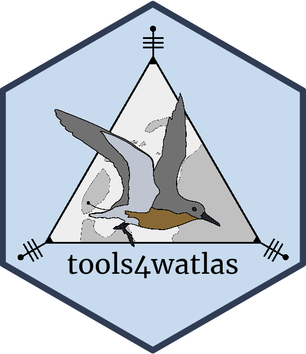
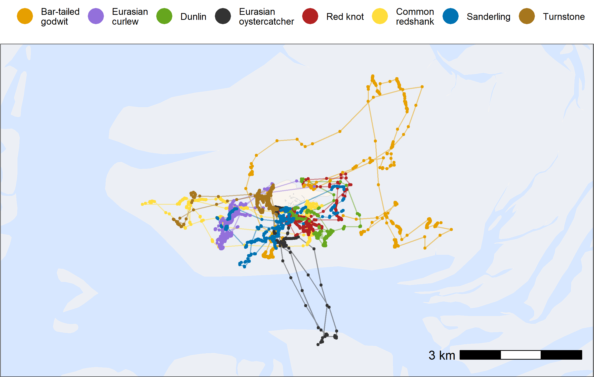
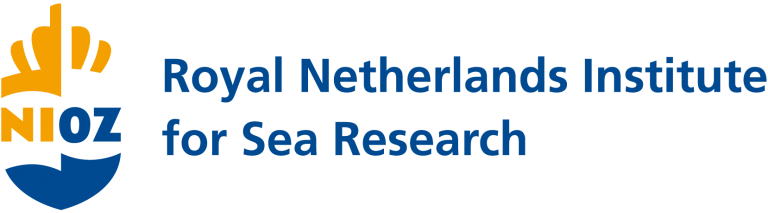

<!-- README.md is generated from README.Rmd. Please edit that file -->

# tools4watlas <a href="https://allertbijleveld.github.io/tools4watlas"></a>

<!-- badges: start -->

[](http://www.repostatus.org/#active)
[](https://www.gnu.org/licenses/gpl-3.0)
[](https://github.com/allertbijleveld/tools4watlas/actions/workflows/R-CMD-check.yaml)
[](https://app.codecov.io/gh/allertbijleveld/tools4watlas)
<!-- badges: end -->

The goal of `tools4watlas` is to provide tools for getting, processing
and plotting WATLAS tracking data. More information on the WATLAS
tracking system can be found in [Bijleveld et al. 2022. WATLAS:
high-throughput and real-time tracking of many small birds in the Dutch
Wadden Sea](https://doi.org/10.1186/s40317-022-00307-w).

Visit <https://www.nioz.nl/en/research/projects/watlas> to follow
tracked birds in real time and to read the latest project news. Feel
free to reach out by [e-mail](mailto:allert.bijleveld@nioz.nl) for
questions or collaborations if you would like to work with WATLAS data.

The package `tools4watlas` builds on the package
[`atlastools`](https://github.com/pratikunterwegs/atlastools) ([Gupte et
al. 2021. A Guide to Pre-processing High-throughput Animal Tracking
Data](https://doi.org/10.1111/1365-2656.13610)). Some major developments
are that we have incorporated
[`data.table`](https://rdatatable.gitlab.io/data.table/) by tag ID. This
approach is more efficient and significantly speeds up processing large
datasets. Additionally, `tools4watlas` includes functions specific to
the Wadden Sea such as integrating tidal and bathymetry data, and more
elaborate functions and tutorials on visualizing movement data.

### **Documentation**

The `tools4watlas` package is thoroughly documented on the [**official
package website**](https://allertbijleveld.github.io/tools4watlas/). The
package vignettes outline the **basic workflow** for working with WATLAS
data, while **extended workflows** guide through more specialized
analyses. Additionally, we provide **visualization tutorials** that
demonstrate various methods for plotting and animating the movement
data. The **package development** section offers insights into package
maintenance and how to contribute to the `tools4watlas` package. To
completely run some articles (marked with an asterisk) access to the
local NIOZ file server is required.

**Basic workflow (Vignettes)**:

- [**Load and check
  data**](https://allertbijleveld.github.io/tools4watlas/articles/load_and_check_data.html)

- [**Filter
  data**](https://allertbijleveld.github.io/tools4watlas/articles/filter_data.html) -
  based on spatial boundaries, temporal specifications, error estimates
  and speed.

- [**Smooth and thin
  data**](https://allertbijleveld.github.io/tools4watlas/articles/smooth_and_thin_data.html)

**Extended workflow**:

- [**Add tidal and bathymetry
  data**\*](https://allertbijleveld.github.io/tools4watlas/articles/extended_workflow/add_tidal_and_bathymetry_data.html)

- [**Add residency
  patches**](https://allertbijleveld.github.io/tools4watlas/articles/extended_workflow/add_residency_patches.html)

**Visualization tutorials**:

- [**Create a
  basemap**](https://allertbijleveld.github.io/tools4watlas/articles/visualization_tutorials/create_basemap.html) -
  (Bathymetry basemap option\*)

- [**Plot
  data**](https://allertbijleveld.github.io/tools4watlas/articles/visualization_tutorials/plot_data.html) -
  an important step between all stages to check the data.

- [**Plot data in
  loop**](https://allertbijleveld.github.io/tools4watlas/articles/visualization_tutorials/plot_data_in_loop.html) -
  quick way to make plots by tag ID.

- [**Fast plotting with
  ggplot2**](https://allertbijleveld.github.io/tools4watlas/articles/visualization_tutorials/fast_plotting.html)

- [**Plot data
  interactively**](https://allertbijleveld.github.io/tools4watlas/articles/visualization_tutorials/plot_data_interactively.html)

- [**Animate
  data**](https://allertbijleveld.github.io/tools4watlas/articles/visualization_tutorials/animate_data.html)

**Package development**:

- [**Package
  maintenance**](https://allertbijleveld.github.io/tools4watlas/articles/package_development/package_maintenance.html) -
  describes how to work on `tools4watlas`.

- [**Basemap
  data**\*](https://allertbijleveld.github.io/tools4watlas/articles/package_development/basemap_data.html) -
  describes how the basemap data were extracted and can guide the user
  in creating customized base maps.

- [**tools4watlas
  logo**](https://allertbijleveld.github.io/tools4watlas/articles/package_development/package_logo.html) -
  describes how the `tools4watlas` logo is made.

\**requires access to the local NIOZ file server*

### **Installation**

You can install the latest version of `tools4watlas` from
[GitHub](https://github.com/allertbijleveld/tools4watlas) with:

``` r
library(remotes)
install_github("allertbijleveld/tools4watlas")
```

### **Example data**

``` r
library(tools4watlas)
library(ggplot2)

# Load example data
data <- data_example

# Create base map
bm <- atl_create_bm(data, buffer = 800)

# Plot points and tracks
bm +
  geom_path(
    data = data, aes(x, y, colour = species),
    linewidth = 0.5, alpha = 0.5, show.legend = FALSE
  ) +
  geom_point(
    data = data, aes(x, y, color = species),
    size = 0.5, alpha = 0.5, show.legend = TRUE
  ) +
  scale_color_manual(
    values = atl_spec_cols(),
    labels = atl_spec_labs("multiline"),
    name = ""
  ) +
  guides(colour = guide_legend(
    nrow = 1, override.aes = list(size = 7, pch = 16, alpha = 1)
  )) +
  theme(
    legend.position = "top",
    legend.justification = "center",
    legend.key = element_blank(),
    legend.background = element_rect(fill = "transparent")
  )
```

<div class="figure" style="text-align: center">


<p class="caption">
Example tracks with one individual by species for two tide cycles
</p>

</div>

### **Work in progress**

More examples of workflows aimed at processing, plotting and adding
environmental data to WATLAS tracking data are being prepared. If you
have a request, please contact [Allert
Bijleveld](mailto:allert.bijleveld@nioz.nl).

We are working on the following articles at the moment:

- Connect WATLAS with SIBES data

### **Contribute**

If you want to contribute to `tools4watlas`
[fork](https://docs.github.com/en/pull-requests/collaborating-with-pull-requests/working-with-forks/fork-a-repo)
the repository on GitHub and then submit a [pull
request](https://docs.github.com/en/pull-requests/collaborating-with-pull-requests/proposing-changes-to-your-work-with-pull-requests/about-pull-requests).
Besides clear bug fixes, it is best to discuss potential changes or
additions with [Allert Bijleveld](mailto:allert.bijleveld@nioz.nl).
Check the article [Package
maintenance](https://allertbijleveld.github.io/tools4watlas/articles/package_development/package_maintenance.html)
for more details.

### **Acknowledgements**

Many people and organisations are involved in developing and maintaining
WATLAS. We particularly thank Sivan Toledo and Ran Nathan for the
initial development of ATLAS, and Frank van Maarseveen and Bas Denissen
for the initial development of the Wadden Sea ATLAS (WATLAS).
Additionally, we thank Remko de Haan, Aris van der Vis, Yetzo de Hoo,
and NMF colleagues for further developments, assemblage and support.
Anne Dekinga is crucial for the field deployment and logistical
solutions. We thank our colleagues from COS for help catching birds,
especially Job ten Horn, Anne Dekinga, and Luc de Monte. Also, we thank
all partners and stakeholders for hosting equipment and for access to
their sites. Lastly, we thank the crews of the RV Wim Wolff and Wim-Jan
Boon of the RV Adriaen Coenen for their help in the field, Marten Tacoma
for visualizing the tracking data in real time on
<https://www.nioz.nl/watlas>, and the many other NIOZ staff and
volunteers that facilitated this work.

<p align="middle">
<a href="https://www.nioz.nl/en">

</a>
</p>
