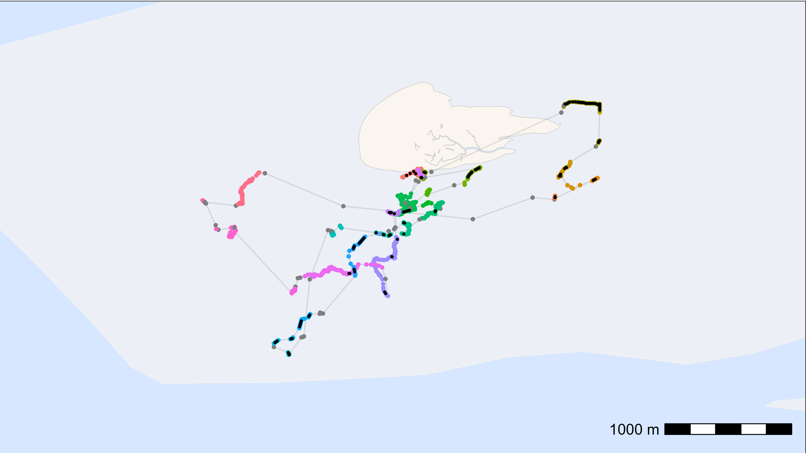

# Interpolate data

This article shows how to interpolate between positions thus filling
gaps in the WATLAS data. Under some circumstances this can be useful,
but one should be cautious and mindful of the data and research
question.

For some analyses, gaps in positioning data can bias the results and
interpolating positions across small gaps can be necesarry. For example,
if birds move some distance within residence patches, the median
position in the patch does not properly reflect space use. Moreover,
within residence patches, especially when birds are on the ground
roosting, it is likely that birds do not move much and interpolation
between positions can be done safely.

Here, we show how to interpolate and fill small data gaps within
residence patches.

## Load packages and data

``` r
# packages
library(tools4watlas)
library(ggplot2)
library(viridis)
library(foreach)
library(doFuture)

# load example data
data <- data_example
```

## Prepare data

To interpolate positions within residence patches, we first need to
calculate residence patches as described in the article [“Add residence
patches”](https://allertbijleveld.github.io/tools4watlas/articles/extended_workflow/add_residence_patches.html).

For convenience and to avoid interpolating many (superfluous) positions,
we suggest aggregating the data into regular intervals as described in
the article [“Smooth and thin
data”](https://allertbijleveld.github.io/tools4watlas/articles/smooth_and_thin_data.html).

``` r
# subset relevant columns
data <- data[, .(species, posID, tag, time, datetime, x, y, tideID)]

# extract the unique tag IDs
id <- unique(data$tag)

# register cores and backend for parallel processing
registerDoFuture()
plan(multisession)

# loop through all tags to calculate residence patches
data <- foreach(i = id, .combine = "rbind") %dofuture% {
  atl_res_patch(
    data[tag == i],
    max_speed = 3, lim_spat_indep = 75, lim_time_indep = 180,
    min_fixes = 3, min_duration = 120
  )
}

# close parallel processing
plan(sequential)

# summary of residence patches
data_summary <- atl_res_patch_summary(data)

# thin the data to 1 min interval
data <- atl_thin_data(
  data = data,
  interval = 60,
  id_columns = c("tag", "species"),
  method = "aggregate"
)
```

### Check data

Before interpolation, it is good inspect the residence patch summary and
check whether interpolating positions is appropriate. For example, if
the residence patches are overly elongated there might be a mistake in
the residence patch calculation. Likewise, if there are large spatial or
temporal gaps between postions, interpolating might be inapproriate.

``` r
# merge species to data_summary
data_summary <- merge(data_summary, unique(data[, .(tag, species)]), by = "tag")

# look at the maximal length of residence patches per species
data_summary[, .(
  max_duration = max(duration) |> atl_format_time()
), by = species]
```

    ##              species max_duration
    ##               <char>       <char>
    ## 1:          redshank    2.7 hours
    ## 2:          red knot    5.1 hours
    ## 3: bar-tailed godwit    3.4 hours
    ## 4:            curlew    2.4 hours
    ## 5:     oystercatcher    7.6 hours
    ## 6:         turnstone    3.4 hours
    ## 7:            dunlin      2 hours
    ## 8:        sanderling      3 hours

The oystercatcher spent 7.6 h in a residence patch, which is quite long,
but possible.

## Interpolate between positions

In this example, we trust the residence patch calculation and we want to
interpolate the data to 1 min intervals within residence patches. We set
the `max_gap` to 8 h, which is longer than the longest residence patch
duration, so that all residence patches are interpolated and we set
`patches_only` to `TRUE`, so that only data within residence patches are
interpolated.

``` r
# interpolate data to 1 min intervals - only within residence patches
data_int <- atl_interpolate_track(
  data = data,
  tag = "tag",
  x = "x",
  y = "y",
  time = "time",
  patch = "patch",
  interp_interval = 60,
  max_gap = 3600 * 8,
  max_dist = NULL,
  patches_only = TRUE
)
```

    ## Note: Interpolation added 1919 positions (28.74% increase).

``` r
# show head of the table
head(data_int) |> knitr::kable(digits = 2)
```

| tag | time | datetime | x | y | patch | gap_next | interpolated |
|:---|---:|:---|---:|---:|:---|---:|:---|
| 3027 | 1695438780 | 2023-09-23 03:13:00 | 650705.6 | 5902556 | 1 | 0 | FALSE |
| 3027 | 1695438840 | 2023-09-23 03:14:00 | 650708.4 | 5902557 | 1 | 360 | TRUE |
| 3027 | 1695438900 | 2023-09-23 03:15:00 | 650711.1 | 5902558 | 1 | 360 | TRUE |
| 3027 | 1695438960 | 2023-09-23 03:16:00 | 650713.9 | 5902559 | 1 | 360 | TRUE |
| 3027 | 1695439020 | 2023-09-23 03:17:00 | 650716.6 | 5902560 | 1 | 360 | TRUE |
| 3027 | 1695439080 | 2023-09-23 03:18:00 | 650719.3 | 5902561 | 1 | 360 | TRUE |

### Plot data and check interpolation

Here, we plot one tag as an example. The positions are coloured by
residence patch, and the interpolated points are shown in black.

``` r
# subset one tag
data_subset <- data_int[tag == "3288"]

# create basemap
bm <- atl_create_bm(data_subset, buffer = 800)

# plot points and tracks with standard ggplot colours
bm +
  geom_path(
    data = data_subset, aes(x, y),
    linewidth = 0.5, alpha = 0.1, show.legend = FALSE
  ) +
  geom_point(
    data = data_subset, aes(x, y, colour = patch),
    size = 1, alpha = 1, show.legend = FALSE
  ) +
  geom_point(
    data = data_subset[interpolated == TRUE], aes(x, y), color = "black",
    size = 0.5, alpha = 1, show.legend = FALSE
  )
```



Looks good!
